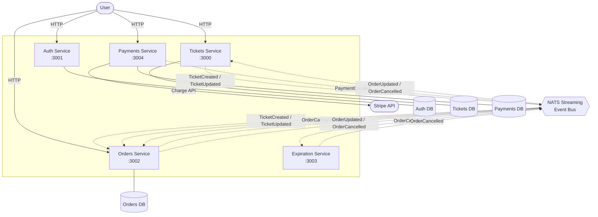

# TicketHub Microservices

A microservices ticket marketplace built with Node.js, TypeScript, and NATS Streaming.

## Overview

This system is split into independent services that communicate using asynchronous events through NATS. Each service owns its own data and business rules.

Core architecture patterns used:

- Event-driven communication with publish/subscribe
- Service-level database ownership
- Optimistic concurrency control for order and ticket updates
- Shared package for common middleware, errors, and event contracts

## Services

| Service | Port | Description |
|---------|------|-------------|
| `auth` | 3001 | Signup, signin, signout, and current user identity |
| `tickets` | 3000 | Ticket creation and listing |
| `orders` | 3002 | Ticket reservation and order lifecycle |
| `payments` | 3004 | Stripe charge processing and payment recording |
| `expiration` | 3003 | Order timeout processing and automatic cancellation |
| `client` | 3500 | Next.js frontend (see below) |
| `common` | — | Shared TypeScript package: errors, middleware, event types |

## Running the Frontend

The `client` folder is a Next.js 14 app that proxies all API calls to the right backend service. No CORS or API gateway setup required.

```bash
cd client
npm install
npm run dev        # starts on http://localhost:3500
```

All services must be running before using the frontend. Start each one in a separate terminal:

```bash
# Terminal 1 – start NATS Streaming
.\nats-server-v2.10.18-windows-amd64\nats-server.exe -p 4222

# Terminal 2 – Auth service
cd auth && npm run start

# Terminal 3 – Tickets service
cd tickets && npm run dev

# Terminal 4 – Orders service
cd orders && npm run start

# Terminal 5 – Payments service
cd payments && npm run start

# Terminal 6 – Expiration service
cd expiration && npm run start

# Terminal 7 – Frontend
cd client && npm run dev
```

Then open http://localhost:3500 in your browser.

### Test Payment Token

The payment page is pre-filled with `tok_visa` — this is a Stripe test-mode token that simulates a successful VISA charge. You need a Stripe account with the secret key set in `payments/.env` (`STRIPE_KEY=sk_test_...`).

## Event Flow

- `tickets` publishes ticket events when tickets are created/updated
- `orders` listens to ticket events and publishes order events
- `expiration` listens for order creation and publishes cancellation when time expires
- `payments` listens/queries order state, creates Stripe charge, then publishes payment events
- `orders` listens to payment events, marks orders complete, and publishes updated order events
- `tickets` listens to order update/cancel events to set/clear reservations

## Architecture Diagram

The diagram below renders directly on GitHub. For full interactive editing, open [docs/architecture.drawio](docs/architecture.drawio) in [diagrams.net](https://app.diagrams.net) via **File → Import From → Device**.



> Solid arrows = synchronous HTTP calls. Dashed arrows = async NATS events.
